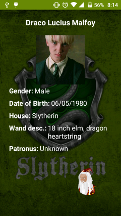

# Kotlin Master Detail Example

The application is a basic example of Clean Architecture with MVP, to learn and practice the use of the programming language kotlin.

In developing progress.

### Built with:

* **Programming language:** [Kotlin]
* **Dependency Injection:** [Dagger2] 
* **Http Client:** [Retrofit2]
* **Image loader:** [Glide]

## Screenshots

### Change Log

## V1.1
* Add functions to assign points with Albus

## V1.0
* Basic example of Master-Detail

### Develop by Jose Luis Balanza

* [LinkedIn]

[LinkedIn]: <https://es.linkedin.com/in/jose-luis-balanza-b9246950>
[Kotlin]: <https://kotlinlang.org/>
[Dagger2]: <http://google.github.io/dagger/>
[Retrofit2]: <http://square.github.io/retrofit/>
[Glide]: <https://github.com/bumptech/glide>
